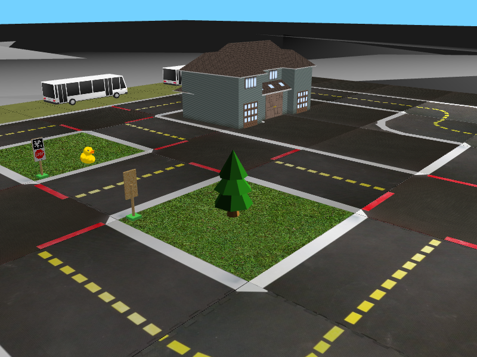

# Gym-Duckietown (Edited for ROSE Soid Project)
# Table of contents

- [Gym-Duckietown (Edited for ROSE Soid Project)](#gym-duckietown-edited-for-rose-soid-project)
- [Table of contents](#table-of-contents)
  - [Introduction ](#introduction-)
  - [Soid Project for ROSE Lab ](#soid-project-for-rose-lab-)
  - [Installation ](#installation-)
    - [Installation Using Conda \& Pip ](#installation-using-conda--pip-)
  - [Usage ](#usage-)
    - [Scenarios ](#scenarios-)
    - [Agents ](#agents-)
    - [Actions ](#actions-)
  - [Reinforcement Learning ](#reinforcement-learning-)
  - [Design ](#design-)
    - [Map File Format ](#map-file-format-)
      - [Map Notes: ](#map-notes-)
  - [Web-Gui (Using Flask and Pipes) ](#web-gui-using-flask-and-pipes-)
    - [Overview ](#overview-)
    - [Front End ](#front-end-)
    - [Back End ](#back-end-)
      - [Flask ](#flask-)
      - [Pipes ](#pipes-)
  - [Troubleshooting ](#troubleshooting-)

<details>
  <summary> **Original Project Citation Information** </summary>
[Duckietown](http://duckietown.org/) self-driving car simulator environments for OpenAI Gym.

Please use this bibtex if you want to cite this repository in your publications:

```
@misc{gym_duckietown,
  author = {Chevalier-Boisvert, Maxime and Golemo, Florian and Cao, Yanjun and Mehta, Bhairav and Paull, Liam},
  title = {Duckietown Environments for OpenAI Gym},
  year = {2018},
  publisher = {GitHub},
  journal = {GitHub repository},
  howpublished = {\url{https://github.com/duckietown/gym-duckietown}},
}
```

This simulator was created as part of work done at [Mila](https://mila.quebec/).

<p align="center">
<br>
</p>

<h2 align="center">
Welcome to <b>Duckietown</b>!
</h2>
</details>

## Introduction <a name="introduction"></a>

Gym-Duckietown is a simulator for the [Duckietown](https://duckietown.org) Universe, written in pure Python/OpenGL (Pyglet). It places your agent, a Duckiebot, inside of an instance of a Duckietown: a loop of roads with turns, intersections, obstacles, Duckie pedestrians, and other Duckiebots. It can be a pretty hectic place!

Gym-Duckietown is fast, open, and incredibly customizable. What started as a lane-following simulator has evolved into a fully-functioning autonomous driving simulator that you can use to train and test your Machine Learning, Reinforcement Learning, Imitation Learning, or even classical robotics algorithms. 

Gym-Duckietown offers a wide range of tasks, from simple lane-following to full city navigation with dynamic obstacles. Gym-Duckietown also ships with features, wrappers, and tools that can help you bring your algorithms to the real robot, including [domain-randomization](https://blog.openai.com/spam-detection-in-the-physical-world/), accurate camera distortion, and differential-drive physics (and most importantly, realistic waddling).


<p align="center">
<br>
</p>

<details>
  <summary> More Details on Original Work </summary>


There are multiple registered gym environments, each corresponding to a different [map file](https://github.com/duckietown/gym-duckietown/tree/master/gym_duckietown/maps):
- `Duckietown-straight_road-v0`
- `Duckietown-4way-v0`
- `Duckietown-udem1-v0`
- `Duckietown-small_loop-v0`
- `Duckietown-small_loop_cw-v0`
- `Duckietown-zigzag_dists-v0`
- `Duckietown-loop_obstacles-v0` (static obstacles in the road)
- `Duckietown-loop_pedestrians-v0` (moving obstacles in the road)

The `MultiMap-v0` environment is essentially a [wrapper](https://github.com/duckietown/gym-duckietown/blob/master/gym_duckietown/envs/multimap_env.py) for the simulator which
will automatically cycle through all available [map files](https://github.com/duckietown/gym-duckietown/tree/master/gym_duckietown/maps). This makes it possible to train on
a variety of different maps at the same time, with the idea that training on a variety of
different scenarios will make for a more robust policy/model.

`gym-duckietown` is an _accompanying_ simulator to real Duckiebots, which allow you to run your code on the real robot. We provide a domain randomization API, which can help you transfer your trained policies from simulation to real world. Without using a domain transfer method, your learned models will likely overfit to various aspects of the simulator, which won't transfer to the real world. When you deploy, you and your Duckiebot will be running around in circles trying to figure out what's going on.

<p align="center">
<br>
</p>

The `Duckiebot-v0` environment is meant to connect to software running on
a real Duckiebot and remotely control the robot. It is a tool to test that policies
trained in simulation can transfer to the real robot. If you want to
control your robot remotely with the `Duckiebot-v0` environment, you will need to
install the software found in the [duck-remote-iface](https://github.com/maximecb/duck-remote-iface)
repository on your Duckiebot.

<p align="center">
<br>
Duckiebot-v0
</p>
</details>

## Soid Project for ROSE Lab <a name="soid"></a>
The `Duckietown` project has been modified extensively to be used as a demonstration of the Soid tool's efficacy. Changes from the original repository include:

- Agent Structure Change
- Map Format Changes (multi-agent support)
- Simulator Changes (multi-agent support)
- Movement Path Following for Agents
- GUI (currently in development)
- Callouts to C binarys for decision logic

Because of this, some of the information in this README may be out of date, or slightly incorrect. Submit issues to repository or ping me (Matt) on Slack / email (matt.elacqua@yale.edu) with any questions.

## Installation <a name="installation"></a>

Requirements:
- Python 3.9
- OpenAI gym
- NumPy
- Pyglet
- PyYAML

### Installation Using Conda & Pip <a name="conda_pip"></a>

You can install all the dependencies, including PyTorch, using [Conda](https://docs.conda.io/en/latest/miniconda.html) as follows. Using MiniConda3:

```
git clone git@github.com:mattelacqua/duckietown-soid.git
```

```
cd duckietown-soid
```

```
conda env create -f environment.yaml
```

You will need to activate your Conda environment and add the package to your Python path before you can use it
by running the following commands (you may have to reshell first for conda to work):

```
conda activate duckietown
```
```
export PYTHONPATH="${PYTHONPATH}:`pwd`"
```
```
cd learning
```
```
export PYTHONPATH="${PYTHONPATH}:`pwd`"
```
```
cd ..
```
```
conda develop .
```

Check to see that it is sourcing the pip and python from the conda environment:

```
which python
```
```
which pip
```

You may have some issues with it not sourcing the correct pip version. If this occurs, do the following:

```
conda activate
```
```
conda install pip
```

Finally, once in the conda environment for duckietown, run pip install using the setup.py (run the following command).

*** Make sure that you install in the conda env. Might run into issues if using your machine env. 

```
pip3 install -e .
```

## Usage <a name="usage"></a>

### Scenarios <a name="scenarios"></a>

An example to test and make sure everything is running correctly can be done with the following command:


```
python agents/example.py configs/example.ini
```

This will run the example, which demonstrates agents moving in the environment and how they do that. I suggest following the functions to get an idea of how everything comes together. To change the number of agents, in the [config file](configs/example.ini), change the NUM_RANDOM_AGENTS setting.

### Agents <a name="agents_basic"></a>

Agents work using the new [Agent class] (/src/gymduckietown/agents.py). As you'll see, agents have many different class members. The most important are noted here.

  + agent_id: The index of the agent in environment's list of agents.
  + cur_pos: Gives an agent's current position on the grid (x, y, z), where y will always be zero.
  + cur_angle: Gives the agent's current angle (East is 0,360 degrees, N is 90, W is 180, S is 270)
  + direction: Current direction (NSEW)
  + actions: The stack of actions which an agent is to perform.
  + state: The differential dynamics state
  + speed: The agent's velocity (determined automatically)
  + forward_step: The agent's acceleration
  + turn_choice: The direction the agent wants to move 'Left, Right, Straight'
  + signal_choice: The direction the agent wants to signal 'Left, Right, Straight'
  + curve: The curve points on the road the agent aims to follow. Depends on their turn_choice.
  + step_count: how many steps the agent has taken

For the most part, it is easiest to create agent's with random spawn positions (using the config), and refer to the agent and modify directly.

An example for modifying the acceleration:

```
agent = env.agents[0]
agent.forward_step = 0.44
```
  
To control agent movement, actions must be added to the agent's action stack using the method `add_actions`.

This can be done using several different methods in the Agent class, and several examples of this are provided in the [agents directory] (/agents). Details about actions can be found [here](#actions).

Each agent is then stepped using env.step(), updating the physics of the environment, and then env.render() must be called to render the changes in the pyglet display.

If using any sort of intersection, object, or other agent detection, we must do checks before stepping, so that we can adjust each agent's action stack accordingly. 

The code for the Agent class can be found at (/src/gymduckietown/agents.py), and the functions for movement, decision logic, etc. can all be found at (/src/gymduckietown/agent)

### Actions <a name="actions"></a>

The simulator uses continuous actions by default. Actions passed to the `step()` function should be numpy arrays containining two numbers between -1 and 1, along with the corresponding action ID, found in [types.c](/src/gym_duckietown/decision_logic/types.c). The two numbers in the action portion of the tuple (index 0) correspond to forward acceleration, and a steering angle, respectively. A positive acceleration makes the robot go forward, and a positive steering angle makes the robot turn left. 

Agents essentially only use 4 kinds of actions:

  + Action.FORWARD: 
    + Move agent forward following the closest tile curve point.
  + Action.INTERSECTION_FORWARD: 
    + Move agent forward following the closest tile curve point. Used to distinguish when it is completing a turn
  + Action.STOP: 
    + The forward acceleration is set to 0. It takes multiple STOP actions to set its speed to 0.
  + Action.INTERSECTION_STOP
    + The stops required to stop at an intersection line.


## Reinforcement Learning <a name="reinforcement"></a>
To train a reinforcement learning agent, you can use the code provided under [/learning/reinforcement/q-learning/train](/learning/reinforcement/q-learning/train). This training example uses a basic q learning algorithm.  A sample command to launch training with default parameters is:

```
python3 learning/reinforcement/q-learning/train.py configs/config.ini
```

To test a learned model, use the following command with default parameters:
```
python3 learning/reinforcement/q-learning/test.py configs/config.ini
```

Then, to visualize the results of training, you can edit the [config file](configs/config.ini) and set render_steps to the value of every step you would like to see.

## Design <a name="design"></a>

### Map File Format <a name="map_format"></a>

The simulator supports a YAML-based file format which is designed to be easy to hand edit. See the [maps subdirectory](/maps) for examples. Each map file has two main sections: a two-dimensional array of tiles, and a listing of objects to be placed around the map. The tiles are based on basic road structures and each have curve points associated with ideal positioning of agents on them. 

The available tile types are:
- empty
- straight
- curve_left
- curve_right
- 3way_left (3-way intersection)
- 3way_right
- 4way (4-way intersection)
- asphalt
- grass
- floor (office floor)

The available object types are:
- barrier
- cone (traffic cone)
- duckie
- duckiebot (model of a Duckietown robot - obselete with new multiagent support)
- tree
- house
- truck (delivery-style truck)
- bus
- building (multi-floor building)
- sign_stop, sign_T_intersect, sign_yield, etc. (see [meshes subdirectory]([(https://github.com/duckietown/duckietown-world/tree/daffy/src/duckietown_world/data/gd1)]) 

Although the environment is rendered in 3D, the map is essentially two-dimensional. As such, objects coordinates are specified along two axes. The coordinates are rescaled based on the tile size, such that coordinates [0.5, 1.5] would mean middle of the first column of tiles, middle of the second row. Objects can have an `optional` flag set, which means that they randomly may or may not appear during training, as a form of domain randomization.

#### Map Notes: <a name="map_notes"></a>
Many of the map files have been broken due to changes in the map format for multiagent support. The basic fix is as follows:
Where you see "start_tile:" (old code for single agent usage), transform to:
    
```
agents: 
  agent0: 
    start_tile: [x, z] 
    start_pose: [[pos_in_tile_x, 0, pos_in_tile_z],  rotation_angle] 
    color: "red"
```
    
Also, keep in mind that multiagent support is available.

For our purposes, the [reinforcement_learning](maps/reinforcement_learning.yaml) suffices. 

## Web-Gui (Using Flask and Pipes) <a name="webgui"></a>

### Overview <a name="webgui_overview"></a>
The GUI we are using is based off of HTML, Javascript, and is webserver based. We are using the python Flask library to start a basic localhost webserver at [127.0.0.1:5000](http://127.0.0.1:5000/). 
The pipeline is as follows:

1. Startup [Flask Server](webserver/server.py) 
```
python3 webserver/server.py
```
(You can spin off a subproccess with it using subprocess.Popen, example in [gui_test.py](agents/gui_test))

2. Startup [Node Server](webserver/web-gui/) in another terminal

```
cd webserver/web-gui
```
If never installed npm packages, install them.
```
npm install --legacy-peer-deps
```
Start the Node js server
```
npm start
```

3. Run your agent program.
```
python3 agents/gui_test.py configs/config.ini
```

What happens here is the webserver will begin and read the initial layout of the 
simulated scene. The user will load the information in, and once it begins to render, the web-gui will updated. 

The user has several options. Pause, Restart, and Quit. 

While the scene is paused, the user can interact with the gui which uses JS/sockets to communicate to webserver.py, which will write information to a [pipe in the webserver directory](webserver/webserver.out). The agent program will then read from this file during the pause cycle for [this example](agents/gui_test). Finally, the user will click the resume simulation button to resume the agent's decision code at that point.


### Front End <a name="front_end"></a>
The front end development is done using React. I highly recommend the [react tutorial](https://reactjs.org/tutorial/tutorial.html) if you are not familiar with it.

### Back End <a name="back_end"></a>
The back end of the webserver is handled in Flask and using pipes for interprocess communication

#### Flask <a name="flask"></a>
The [flask file](webserver/server.py) is a basic example of creating a flaskapp with sockets to communicate with programs.
The @app.route("/") is the base webserver html templet that gets rendered.

The socketio uses the app to open a socket for communication that gets pinged every second or so for updates.

The update function takes the information from the socket, and writes to the pipe under certain conditions (used right now in testing).

#### Pipes <a name="pipes"></a>
We are using FIFO pipe text files for communication between the webserver and simulator. These are located in the [webserver](webserver) directory. 

The [webserver.out](webserver.out) pipe is used for any information recieved on the webserver that we would like to write and give to the simulator. The [webserver.in](webserver.in) is used for interprocess communication in the other direction, Simulator -> Webserver.

We are using the Pickle library to serialize and unserialize several different sorts of gui input (each of these object classes can be found in [gui_utils.py](src/gym_duckietown/gui_utils.py).

## Troubleshooting <a name="troubleshooting"></a>

If you run into problems of any kind, don't hesitate to [open an issue](https://github.com/mattelacqua/duckietown-soid/issues) on this repository. It's quite possible that you've run into some bug we aren't aware of. Please make sure to give some details about your system configuration (ie: PC or Max, operating system), and to paste the command you used to run the simulator, as well as the complete error message that was produced, if any.

<details>
  <summary> AttributeError: module 'numpy' has no attribute 'int' </summary>

  This error has to do with a short naming in the numpy module. To fix this, simply open the file at 
  
  (PATH_TO_MINICONDA)/miniconda3/envs/duckietown/lib/python3.9/site-packages/contracts/library/array_ops.py

  You will see ~ line 224 the following:

  ```
  np_types = {
    #'np_int': np.int,  # Platform integer (normally either int32 or int64)
    'np_int8': np.int8,  # Byte (-128 to 127)
    'np_int16': np.int16,  # Integer (-32768 to 32767)
    'np_int32': np.int32,  # Integer (-2147483648 to 2147483647)
    'np_int64': np.int64,  # Integer (9223372036854775808 to 9223372036854775807)
    'np_uint8': np.uint8,  # Unsigned integer (0 to 255)
    'np_uint16': np.uint16,  # Unsigned integer (0 to 65535)
    'np_uint32': np.uint32,  # Unsigned integer (0 to 4294967295)
    'np_uint64': np.uint64,  # Unsigned integer (0 to 18446744073709551615)
    #'np_float': np.float,  # Shorthand for float64.
    'np_float16': np.float16,  # Half precision float: sign bit, 5 bits exponent, 10 bits mantissa
    'np_float32': np.float32,  # Single precision float: sign bit, 8 bits exponent, 23 bits mantissa
    'np_float64': np.float64,  # Double precision float: sign bit, 11 bits exponent, 52 bits mantissa
    #'np_complex': np.complex,  # Shorthand for complex128.
    'np_complex64': np.complex64,  # Complex number, represented by two 32-bit floats (real and imaginary components)
    'np_complex128': np.complex128}
  
  ```
  As done above, comment out the lines with shorthand names (np_int, np_float, np_complex)   

</details>

<details>
  <summary> AttributeError: dlsym(0x4ee1b4118 class_getMethodImplementation_stret): symbol not found </summary>

  This is common for new M1 mac machines, as the cocoapy library is missing platforming for arm64. We simply have to add it. 

  Open the file at (PATH_TO_MINICONDA)/miniconda3/envs/duckietown/lib/python3.9/site-packages/pyglet/libs/darwin/cocoapy/runtime.py

  Wrap the following lines in the conditional platform check:
   
  ~133
  ```
  # IMP class_getMethodImplementation_stret(Class cls, SEL name)
  if platform.machine() != "arm64":
    objc.class_getMethodImplementation_stret.restype = c_void_p
    objc.class_getMethodImplementation_stret.argtypes = [c_void_p, c_void_p]
  ```
  ~283
  ```
  if platform.machine() != "arm64":
    objc.objc_msgSendSuper_stret.restype = None
  ```
  ~289
  ```
  if platform.machine() != "arm64":
    objc.objc_msgSend_stret.restype = None
  ```

</details>

<details>
  <summary> ValueError: setting an array element with a sequence. The requested array has an inhomogeneous shape after 1 dimensions. The detected shape was (2,) + inhomogeneous part. </summary>

  This is due to a new issue in numpy. 

  To fix, go to (PATH_TO_MINICONDA)/miniconda3/envs/duckietown/lib/python3.9/site-packages/geometry/poses.py

  Around line ~274 change the d=float64 -> d=object in the following function:
  ```
  def se2_from_linear_angular(linear: Union[T2value, List[float]], angular: float) -> SE2value:
    """ Returns an element of se2 from linear and angular velocity. """
    linear = np.array(linear, dtype='object')
    M = hat_map_2d(angular)
    return combine_pieces(M, linear, linear * 0, 0)
  ```
</details>