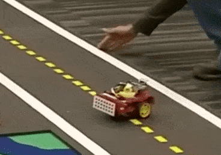

# Gym-Duckietown (Edited for ROSE Soid Project)
# Table of contents

- [Introduction](#introduction)  
- [Soid](#soid)  
- [Installation](#installation)  
  - [Conda & Pip](#conda_pip)  
- [Usage](#usage)  
  - [Agents](#agents_basic)  
        - [Actions](#actions)  
        - [Single Agent Scenarios](#single_agent)  
        - [Multi Agent Scenarios](#multi_agent)  
  
  - [Neural Approaches](#neural)  
        - [Reinforcement](#reinforcement)  
        - [Imitation](#imitation)  
        - [Observation](#observation)  
        - [Reward](#reward)    
- [Design](#design)  
  - [Map Format](#map_format)  
  - [Map Information](#map_notes)  
- [Web-Gui](#webgui)  
  - [Overview](#webgui_overview)  
  - [Front End](#front_end)  
        - [HTML](#html)  
  - [Back End](#back_end)  
        - [Flask Files](#flask)  
        - [Using Pipes](#pipes)  
- [Troubleshooting](#troubleshooting)  

<details>
  <summary> **Original Project Citation Information** </summary>
[Duckietown](http://duckietown.org/) self-driving car simulator environments for OpenAI Gym.

Please use this bibtex if you want to cite this repository in your publications:

```
@misc{gym_duckietown,
  author = {Chevalier-Boisvert, Maxime and Golemo, Florian and Cao, Yanjun and Mehta, Bhairav and Paull, Liam},
  title = {Duckietown Environments for OpenAI Gym},
  year = {2018},
  publisher = {GitHub},
  journal = {GitHub repository},
  howpublished = {\url{https://github.com/duckietown/gym-duckietown}},
}
```

This simulator was created as part of work done at [Mila](https://mila.quebec/).

<p align="center">
<br>
</p>

<h2 align="center">
Welcome to <b>Duckietown</b>!
</h2>
</details>

## Introduction <a name="introduction"></a>

Gym-Duckietown is a simulator for the [Duckietown](https://duckietown.org) Universe, written in pure Python/OpenGL (Pyglet). It places your agent, a Duckiebot, inside of an instance of a Duckietown: a loop of roads with turns, intersections, obstacles, Duckie pedestrians, and other Duckiebots. It can be a pretty hectic place!

Gym-Duckietown is fast, open, and incredibly customizable. What started as a lane-following simulator has evolved into a fully-functioning autonomous driving simulator that you can use to train and test your Machine Learning, Reinforcement Learning, Imitation Learning, or even classical robotics algorithms. Gym-Duckietown offers a wide range of tasks, from simple lane-following to full city navigation with dynamic obstacles. Gym-Duckietown also ships with features, wrappers, and tools that can help you bring your algorithms to the real robot, including [domain-randomization](https://blog.openai.com/spam-detection-in-the-physical-world/), accurate camera distortion, and differential-drive physics (and most importantly, realistic waddling).

<p align="center">
<br>
</p>

There are multiple registered gym environments, each corresponding to a different [map file](https://github.com/duckietown/gym-duckietown/tree/master/gym_duckietown/maps):
- `Duckietown-straight_road-v0`
- `Duckietown-4way-v0`
- `Duckietown-udem1-v0`
- `Duckietown-small_loop-v0`
- `Duckietown-small_loop_cw-v0`
- `Duckietown-zigzag_dists-v0`
- `Duckietown-loop_obstacles-v0` (static obstacles in the road)
- `Duckietown-loop_pedestrians-v0` (moving obstacles in the road)

The `MultiMap-v0` environment is essentially a [wrapper](https://github.com/duckietown/gym-duckietown/blob/master/gym_duckietown/envs/multimap_env.py) for the simulator which
will automatically cycle through all available [map files](https://github.com/duckietown/gym-duckietown/tree/master/gym_duckietown/maps). This makes it possible to train on
a variety of different maps at the same time, with the idea that training on a variety of
different scenarios will make for a more robust policy/model.

`gym-duckietown` is an _accompanying_ simulator to real Duckiebots, which allow you to run your code on the real robot. We provide a domain randomization API, which can help you transfer your trained policies from simulation to real world. Without using a domain transfer method, your learned models will likely overfit to various aspects of the simulator, which won't transfer to the real world. When you deploy, you and your Duckiebot will be running around in circles trying to figure out what's going on.

<p align="center">
<br>
</p>

The `Duckiebot-v0` environment is meant to connect to software running on
a real Duckiebot and remotely control the robot. It is a tool to test that policies
trained in simulation can transfer to the real robot. If you want to
control your robot remotely with the `Duckiebot-v0` environment, you will need to
install the software found in the [duck-remote-iface](https://github.com/maximecb/duck-remote-iface)
repository on your Duckiebot.

<p align="center">
<br>
Duckiebot-v0
</p>

## Soid Project for ROSE Lab <a name="soid"></a>
The `Duckietown` project has been modified extensively to be used as a demonstration of the Soid tool's efficacy. Changes from the original repository include:

- Agent Structure Change
- Map Format Changes (multi-agent support, object parameter changes)
- Simulator Changes (multi-agent support)
- Movement Libraries for Agents
- GUI (currently in development)
- Callouts to C binarys for symbolic execution (currently in development)

Because of this, some of the information in this README may be out of date, or slightly incorrect. Submit issues to repository or ping me (Matt) on Slack / email (matt.elacqua@yale.edu) with any questions.

## Installation <a name="installation"></a>

Requirements:
- Python 3.9
- OpenAI gym
- NumPy
- Pyglet
- PyYAML
- PyTorch

### Installation Using Conda & Pip <a name="conda_pip"></a>

You can install all the dependencies, including PyTorch, using [Conda](https://docs.conda.io/en/latest/miniconda.html) as follows. Using MiniConda3:

```
git clone git@github.com:mattelacqua/duckietown-soid.git
cd duckietown-soid
conda env create -f environment.yaml

```

Please note that if you use Conda to install this package instead of pip, you will need to activate your Conda environment and add the package to your Python path before you can use it
by running the following commands (you may have to reshell first for conda to work):

```
source activate duckietown
export PYTHONPATH="${PYTHONPATH}:`pwd`"
cd learning
export PYTHONPATH="${PYTHONPATH}:`pwd`"
cd ..
conda develop .
```

Finally, once in the conda environment for duckietown, run pip install using the setup.py (run the following command).
*** Make sure that you install in the conda env. Might run into issues if using your machine env.

```
pip3 install -e .
```

## Usage <a name="usage"></a>

### Agents (No Deep Learning) <a name="agents_basic"></a>

Agents work using the new [Agent class] (/src/gymduckietown/agents.py). Essentially, the pipeline for creating an agent example is as follows:

Define the agent in the map file.
  For example, the [turning test] (/maps/turning_test.yaml) agent to test turning.
  Each agent in the agent section needs a name, followed by a start_tile, start_pose (position and angle relative to start tile), and a color.
  
To write a program and control agent movement, actions must be added to the agent's action stack using the method `add_actions`.
This can be done using several different methods in the Agent class, and several examples of this are provided in the [agents directory] (/agents). Details about actions can be found [here](#actions).

Each agent is then stepped, updating the physics of the environement, and then render_step must be called to render the changes in the pyglet display.

If using any sort of intersection, object, or other agent detection, we must do checks before stepping, so that we can adjust each agent's action stack accordingly.

### Actions <a name="actions"></a>

The simulator uses continuous actions by default. Actions passed to the `step()` function should be numpy arrays containining two numbers between -1 and 1. These two numbers correspond to forward velocity, and a steering angle, respectively. A positive velocity makes the robot go forward, and a positive steering angle makes the robot turn left. Use methods in the new [Agent class] (/src/gymduckietown/agents.py) for discrete actions such as "move forward", "turn left", "stop", etc.

#### Single-Agent Scenarios <a name="single_agent"></a>

There is a simple UI application which allows you to control the simulation or real robot manually. The `manual_control.py` application will launch the Gym environment, display camera images and send actions (keyboard commands) back to the simulator or robot. You can specify which map file to load with the `--map-name` argument:

```
python3 agents/manual_control.py --env-name Duckietown-4way_duckies-v0 --map-name 4way_duckies.yaml --cam-mode human
```

The intersection agent will go appproach an intersection, stop before it, turn right/left or go straight randomly (can change the choice argument in handle_intersection from None to one of 'Right', 'Left', 'Straight' for deterministic choice) and continue on until the road and simulation end.
This makes use of several [if then else agent functions](/src/gym_duckietown/agents.py) that can be used in other agents.

```
python3 agents/intersection_agent.py --env-name Duckietown-4way_large-v0 --map-name 4way_large.yaml --cam-mode top_down
```

#### Multi-Agent Scenarios <a name="multi_agent"></a>

The simulator has been modified to treat other duckiebots as alternative agents as opposed to dynamic objects. An example using the new map format can be found at [maps/4way_duckies](/maps/4way_duckies.yaml)

To test this, run the following command:

```
python3 agents/duckie_intersection.py --env-name Duckietown-4way_duckies-v0 --map-name 4way_duckies.yaml --safety-factor 0.5 --cam-mode top_down
```


## Neural Approaches (Not Relevant for Soid Yet) <a name="neural"></a>

### Reinforcement Learning Agents <a name="reinforcement"></a>
<details>
  <summary> Not Relevant For Soid Yet. </summary>

To train a reinforcement learning agent, you can use the code provided under [/learning/reinforcement/pytorch](/learning/reinforcement/pytorch). This training example uses DDPG algorithm.  A sample command to launch training with default parameters is:

```
python3 learning/reinforcement/pytorch/train_reinforcement.py 
```

To see a list of training parameters run:

```
python3 learning/reinforcement/pytorch/train_reinforcement.py -h
```

Then, to visualize the results of training, you can run the following command. Note that you can do this while the training process is still running. Also note that if you are running this through SSH, you will need to enable X forwarding to get a display:

```
python3 learning/reinforcement/pytorch/enjoy_reinforcement.py
```
</details>

### Imitation Learning <a name="imitation"></a>
<details>
  <summary> Not Relevant For Soid Yet. </summary>
There is are several different imitation learning examples. Those that are currently working are: ([basic](learning/imitation/basic))
To run the basic training run:

```
python3 learning/imitation/basic/train_imitation.py
```

To see a list of training parameters run:

```
python3 learning/imitation/basic/train_imitation.py -h
```

Then, to visualize the results of training, you can run the following command. Note that you can do this while the training process is still running (***UNSURE IF TRUE***). Also note that if you are running this through SSH, you will need to enable X forwarding to get a display:

```
python3 learning/imitation/basic/enjoy_imitation.py
```
</details>

### Observations <a name="observation"></a>
<details>
  <summary> Not Relevant For Soid Yet. </summary>
The observations are single camera images, as numpy arrays of size (120, 160, 3). These arrays contain unsigned 8-bit integer values in the [0, 255] range.
This image size was chosen because it is exactly one quarter of the 640x480 image resolution provided by the camera, which makes it fast and easy to scale down
the images. The choice of 8-bit integer values over floating-point values was made because the resulting images are smaller if stored on disk and faster to send over a networked connection.
</details>

### Reward Function <a name="reward"></a>
<details>
  <summary> Not Relevant For Soid Yet. </summary>
The default reward function tries to encourage the agent to drive forward along the right lane in each tile. Each tile has an associated bezier curve defining the path the agent is expected to follow. The agent is rewarded for being as close to the curve as possible, and also for facing the same direction as the curve's tangent. The episode is terminated if the agent gets too far outside of a drivable tile, or if the `max_steps` parameter is exceeded. 
</details>

## Design <a name="design"></a>

### Map File Format <a name="map_format"></a>

The simulator supports a YAML-based file format which is designed to be easy to hand edit. See the [maps subdirectory](/maps) for examples. Each map file has two main sections: a two-dimensional array of tiles, and a listing of objects to be placed around the map. The tiles are based on basic road structures and each have curve points associated with ideal positioning of agents on them. 

The available tile types are:
- empty
- straight
- curve_left
- curve_right
- 3way_left (3-way intersection)
- 3way_right
- 4way (4-way intersection)
- asphalt
- grass
- floor (office floor)

The available object types are:
- barrier
- cone (traffic cone)
- duckie
- duckiebot (model of a Duckietown robot - obselete with new multiagent support)
- tree
- house
- truck (delivery-style truck)
- bus
- building (multi-floor building)
- sign_stop, sign_T_intersect, sign_yield, etc. (see [meshes subdirectory]([(https://github.com/duckietown/duckietown-world/tree/daffy/src/duckietown_world/data/gd1)]) 

Although the environment is rendered in 3D, the map is essentially two-dimensional. As such, objects coordinates are specified along two axes. The coordinates are rescaled based on the tile size, such that coordinates [0.5, 1.5] would mean middle of the first column of tiles, middle of the second row. Objects can have an `optional` flag set, which means that they randomly may or may not appear during training, as a form of domain randomization.

#### Map Notes: <a name="map_notes"></a>
Many of the map files have been broken due to changes in the map format for multiagent support. The basic fix is as follows:
Where you see "start_tile:" (old code for single agent usage), transform to:
    
```
agents: 
  agent0: 
    start_tile: [x, z] 
    start_pose: [[pos_in_tile_x, 0, pos_in_tile_z],  rotation_angle] 
    color: "red"
```
    
Also, keep in mind that multiagent support is available.

## Web-Gui (Using Flask and Pipes) <a name="webgui"></a>

### Overview <a name="webgui_overview"></a>
The GUI we are using is based off of HTML, Javascript, and is webserver based. We are using the python Flask library to start a basic localhost webserver at [127.0.0.1:5000](http://127.0.0.1:5000/). (This can be a little wonky, sometimes you have to refresh a bunch or clear cookies / incognito mode - not sure why.) The pipeline is as follows:

1. Startup [Flask Server](webserver/server.py)
```
python3 webserver/server.py
```

2. Run your agent program.
```
python3 agents/gui_test.py --env-name Duckietown-gui_test-v0 --map-name gui_test.yaml --cam-mode top_down
```

*** The webserver will not open and work until there is someone listening on the other end of the pipe. This should get fixed once I background run this.

What happens here is the webserver will begin, and based on what happens on the webserver, it will write information to a [pipe in the webserver directory](webserver/webserver.out). The agent program will then read from this file at given points (during the pause cycle for [this example](agents/gui_test)). 
*** STILL WORK IN PROGRESS FOR BACK END OF THIS

Not yet implemented:
The agent program will then take into account the information it reads in from the webserver pipe and adjust the server accordingly. 
The simulator will then give the new information to the webserver.

### Front End <a name="front_end"></a>
The front end development is done using HTML.

#### HTML <a name="html"></a>
The [HTML file](webserver/html/index.html) used in [this example](webserver/server.py) uses bootstrap and java script to create a slider. 

Take a look at this to see how in the body it creates the Responsive Slider, and after it, there is a script to display the value as well as a socketio script to send the 'update' function with the value on the slider through the socket in the webserver [flask file](webserver/server.py). 

### Back End <a name="back_end"></a>
The back end of the webserver is handled in Flask and using pipes for interprocess communication

#### Flask <a name="flask"></a>
The [flask file](webserver/server.py) is a basic example of creating a flaskapp with sockets to communicate with programs.
The @app.route("/") is the base webserver html templet that gets rendered.

The socketio uses the app to open a socket for communication that gets pinged every second or so for updates.

The update function takes the information from the socket, and writes to the pipe under certain conditions (used right now in testing).


#### Pipes <a name="pipes"></a>
We are using FIFO pipe text files for communication between the webserver and simulator. These are located in the [webserver](webserver) directory. 

The [webserver.out](webserver.out) pipe is used for any information recieved on the webserver that we would like to write and give to the simulator. The [webserver.in](webserver.in) is used for interprocess communication in the other direction, Simulator -> Webserver.

*** Still determining the format of how this will work, and actually getting it to work, but will update this once i figure thigns out.


## Troubleshooting (Has not been updated for Soid) <a name="troubleshooting"></a>

If you run into problems of any kind, don't hesitate to [open an issue](https://github.com/mattelacqua/duckietown-soid/issues) on this repository. It's quite possible that you've run into some bug we aren't aware of. Please make sure to give some details about your system configuration (ie: PC or Max, operating system), and to paste the command you used to run the simulator, as well as the complete error message that was produced, if any.

<details>
  <summary> Click to open anyways. </summary>
### ImportError: Library "GLU" not found

You may need to manually install packaged needed by Pyglet or OpenAI Gym on your system. The command you need to use will vary depending which OS you are running. For example, to install the glut package on Ubuntu:

```
sudo apt-get install freeglut3-dev
```

And on Fedora:

```
sudo dnf install freeglut-devel
```

### NoSuchDisplayException: Cannot connect to "None"

If you are connected through SSH, or running the simulator in a Docker image, you will need to use xvfb to create a virtual display in order to run the simulator. See the "Running Headless" subsection below.

### Running headless

The simulator uses the OpenGL API to produce graphics. This requires an X11 display to be running, which can be problematic if you are trying to run training code through on SSH, or on a cluster. You can create a virtual display using [Xvfb](https://en.wikipedia.org/wiki/Xvfb). The instructions shown below illustrate this. Note, however, that these instructions are specific to MILA, look further down for instructions on an Ubuntu box:

```
# Reserve a Debian 9 machine with 12GB ram, 2 cores and a GPU on the cluster
sinter --reservation=res_stretch --mem=12000 -c2 --gres=gpu

# Activate the gym-duckietown Conda environment
source activate gym-duckietown

cd gym-duckietown

# Add the gym_duckietown package to your Python path
export PYTHONPATH="${PYTHONPATH}:`pwd`"

# Load the GLX library
# This has to be done before starting Xvfb
export LD_LIBRARY_PATH=/Tmp/glx:$LD_LIBRARY_PATH

# Create a virtual display with OpenGL support
Xvfb :$SLURM_JOB_ID -screen 0 1024x768x24 -ac +extension GLX +render -noreset &> xvfb.log &
export DISPLAY=:$SLURM_JOB_ID

# You are now ready to train
```

### Running headless and training in a cloud based environment (AWS)

We recommend using the Ubuntu-based [Deep Learning AMI](https://aws.amazon.com/marketplace/pp/B077GCH38C) to provision your server which comes with all the deep learning libraries.

```
# Install xvfb
sudo apt-get install xvfb mesa-utils -y

# Remove the nvidia display drivers (this doesn't remove the CUDA drivers)
# This is necessary as nvidia display doesn't play well with xvfb
sudo nvidia-uninstall -y

# Sanity check to make sure you still have CUDA driver and its version
nvcc --version

# Start xvfb
Xvfb :1 -screen 0 1024x768x24 -ac +extension GLX +render -noreset &> xvfb.log &

# Export your display id
export DISPLAY=:1

# Check if your display settings are valid
glxinfo

# You are now ready to train
```

### Poor performance, low frame rate

It's possible to improve the performance of the simulator by disabling Pyglet error-checking code. Export this environment variable before running the simulator:

```
export PYGLET_DEBUG_GL=True
```

### RL training doesn't converge

Reinforcement learning algorithms are extremely sensitive to hyperparameters. Choosing the
wrong set of parameters could prevent convergence completely, or lead to unstable performance over
training. You will likely want to experiment. A learning rate that is too low can lead to no
learning happening. A learning rate that is too high can lead unstable performance throughout
training or a suboptimal result.

The reward values are currently rescaled into the [0,1] range, because the RL code in
`pytorch_rl` doesn't do reward clipping, and deals poorly with large reward values. Also
note that changing the reward function might mean you also have to retune your choice
of hyperparameters.

### Unknown encoder 'libx264' when using gym.wrappers.Monitor

It is possible to use `gym.wrappers.Monitor` to record videos of the agent performing a task. See [examples here](https://www.programcreek.com/python/example/100947/gym.wrappers.Monitor).

The libx264 error is due to a problem with the way ffmpeg is installed on some linux distributions. One possible way to circumvent this is to reinstall ffmpeg using conda:

```
conda install -c conda-forge ffmpeg
```

Alternatively, screencasting programs such as [Kazam](https://launchpad.net/kazam) can be used to record the graphical output of a single window.
</details>
